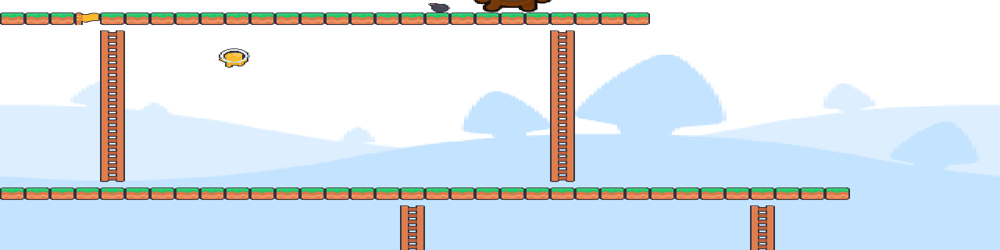
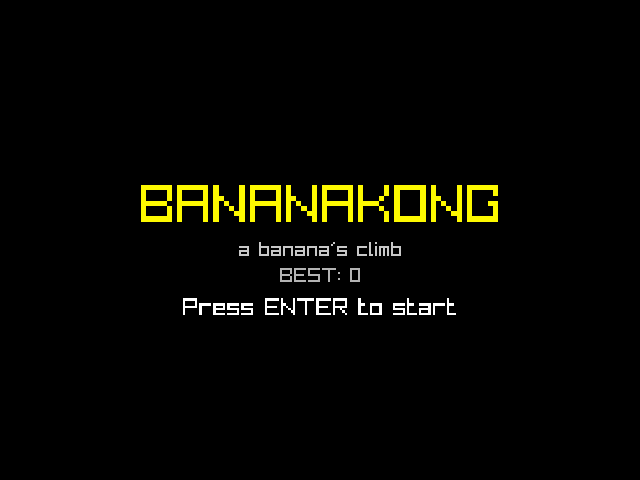
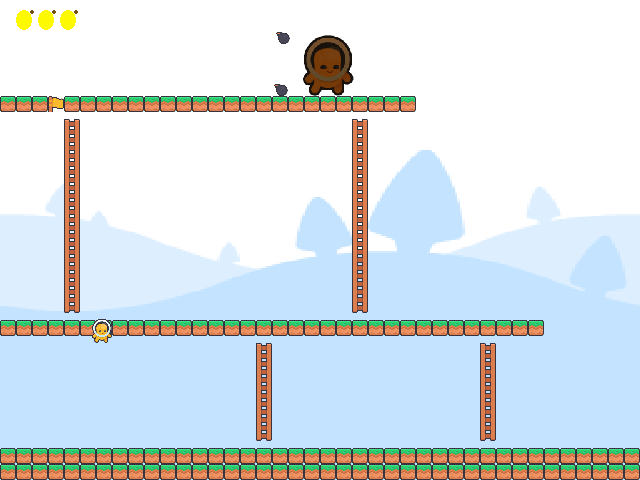
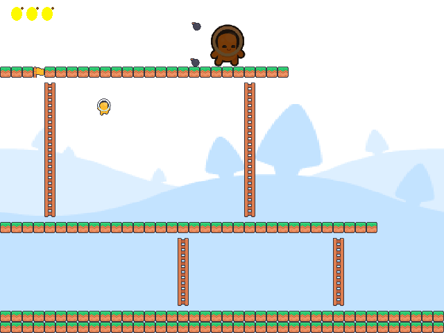

# bananakong

A Donkey Kong-inspired platformer written in C with [raylib](https://www.raylib.com/).



## About the game

You play as **a heroic banana** on a single-screen climbing challenge. Kong,
the big ape on the top platform, paces back and forth and hurls barrels your
way. They roll across platforms, bounce off walls and screen edges, crash down
ladders, and every so often one sails over your head in a high arc and lands a
floor or two below. Your goal is simple: dodge the barrels, scale the wooden
platforms, and reach the **golden flag** at the very top.

Each climb tests your timing as much as your reflexes - barrels never stop
coming, so every pause means another one is rolling your way. Get hit and you
lose a life; run out of three lives and it is game over. Each hit respawns you
on the opposite side of the stage. Score points by surviving barrels, by
stomping them from above (bounce off their tops for +50), and by winning the
climb.

Rendering and sound use free pixel-art sprites and effects from the
[Kenney "New Platformer" pack](https://kenney.nl/assets) (CC0 license).

## Features

- Grid-based Donkey Kong-style level: platforms, ladders, and a goal flag.
- A patrolling **Kong** boss that throws barrels, alternating direction and
  lobbing high arcs that clear a floor or two.
- Banana hero with smooth movement, jumping, and ladder climbing.
- Rolling barrels that fall off edges, crash down ladders, bounce off walls
  and screen edges, and hop when they reverse or land a step down.
- Stomp barrels from above to smash them (+50) and bounce back up.
- Two spawn points; each hit respawns you on the opposite side.
- Three lives, scoring, and a blinking invulnerability window after hits.
- Title, game-over, and win screens with one-key restart.
- Pause with `P`, score popups, a score-based difficulty ramp, and a
  persistent best score.
- Pure-logic modules (`physics`, `level`) with unit tests.
- Sprite rendering and sound effects from the Kenney New Platformer pack.
- Runs at 60 FPS with a fixed-size 640x480 window.

## Screenshots

| Title screen | Gameplay | Climbing the ladder |
|---|---|---|
|  |  |  |

## Install raylib

### Linux (Fedora / RHEL)
```bash
sudo dnf install raylib-devel cmake gcc make
```

### Linux (Debian / Ubuntu)
```bash
sudo apt install libraylib-dev cmake gcc make
```

### macOS
```bash
brew install raylib cmake
```

### Windows
Install [CMake](https://cmake.org/download/) and a compiler such as
[MSYS2/MinGW-w64](https://www.msys2.org/), then install raylib via MSYS2:
```bash
pacman -S mingw-w64-x86_64-raylib
```
Or build raylib from [source](https://github.com/raysan5/raylib) and point CMake at it.

## Build & run

```bash
cmake -B build
cmake --build build
./build/bananakong
```

The CMake setup finds raylib automatically via its config file, pkg-config,
or a manual library lookup, so it works across all three platforms above.

## Run tests

```bash
ctest --test-dir build --output-on-failure
```

Unit tests cover the physics helpers (including stomp detection), level tile
queries and connectivity, the difficulty ramp, score popups, and high-score
persistence (147 checks).

## Controls

| Action  | Keys                      |
|---------|---------------------------|
| Move    | Arrow keys / WASD         |
| Jump    | Space                     |
| Climb   | Up / Down on a ladder     |
| Pause   | P                         |
| Start / restart | Enter           |

## Project layout

```
src/
├── main.c              entry point and game loop
├── config/constants.h  shared tuning constants
├── core/               game state, rendering, physics helpers
├── entities/           player and barrel logic + drawing
└── world/              level grid and collision queries
assets/                 Kenney sprites and sound effects (CC0)
tests/                  unit tests (physics, level, difficulty, popup, highscore)
```

## Docs

- [CONSTRAINTS.md](CONSTRAINTS.md) - coding rules
- [CONTRIBUTING.md](CONTRIBUTING.md) - git workflow
- [CHANGELOG.md](CHANGELOG.md) - release history

## Resources

- [raylib.com](https://www.raylib.com/) - home page and news
- [raylib cheatsheet (HTML)](https://www.raylib.com/cheatsheet/raylib_cheatsheet.html)
- [raylib cheatsheet (PDF)](https://www.raylib.com/cheatsheet/raylib_cheatsheet.pdf)
- [raylib examples](https://www.raylib.com/examples.html)
- [raylib.h reference](https://www.raylib.com/gh-pages-doc/raylib.html)
- [raylib wiki](https://github.com/raysan5/raylib/wiki)
- [Coding conventions](https://github.com/raysan5/raylib/wiki/Coding-conventions),
  [architecture](https://github.com/raysan5/raylib/wiki/Architecture),
  [CMake build system](https://github.com/raysan5/raylib/wiki/Using-raylib-in-CMake),
  and [FAQ](https://github.com/raysan5/raylib/wiki/FAQ)

## Assets

Sprites and sound effects come from the Kenney "New Platformer" pack
([CC0](https://creativecommons.org/publicdomain/zero/1.0/)), courtesy of
[Kenney](https://kenney.nl). The license file is bundled at
[`assets/LICENSE-Kenney.txt`](assets/LICENSE-Kenney.txt).

## License

MIT. See [LICENSE](LICENSE).